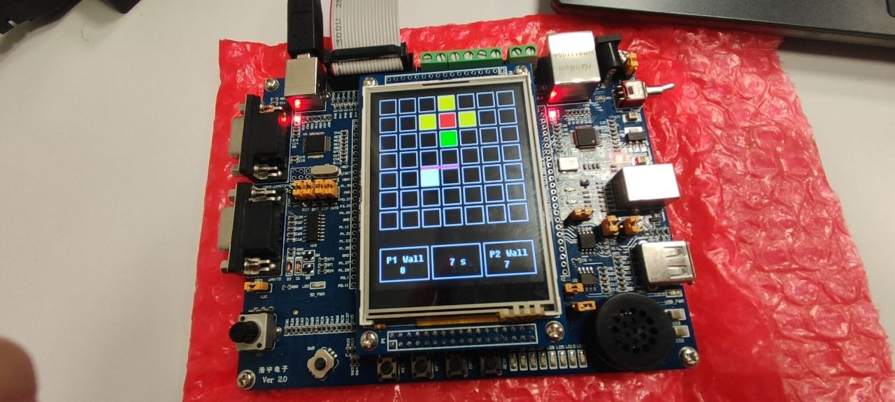
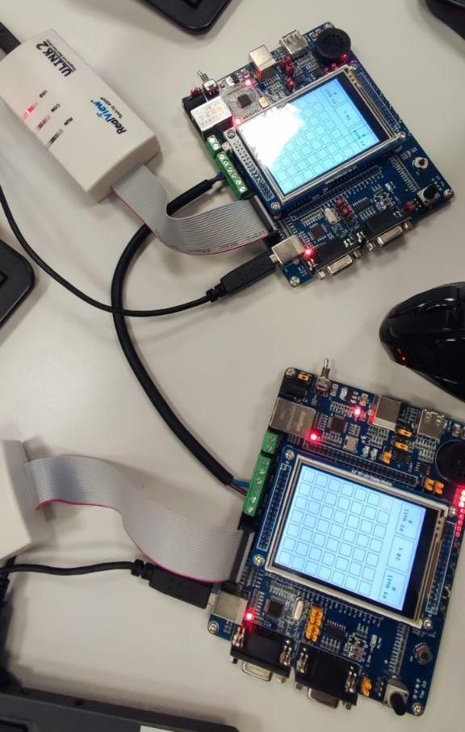

# Quoridor for NXP LPC1768 (LandTiger V2.0) 🎮

This project is an embedded implementation of the famous abstract board game Quoridor (published in 1997 by Gigamic). The system was entirely developed for the **LandTiger V2.0** development board based on the **NXP LPC1768** microcontroller, using the Keil µVision development environment.

The game includes a single-player mode against an Artificial Intelligence (NPC) and a complex inter-board multiplayer mode leveraging the CAN bus communication protocol.

## ✨ Main Features

* **Single Board Mode:** Allows playing on a single board against a human opponent or a computer-controlled opponent (NPC).
* **Two Board Mode (Multiplayer):** Allows two players to play in real-time on two separate hardware boards. Communication is reliably handled via the CAN bus.
* **Integrated Artificial Intelligence:** The NPC dynamically evaluates the game state using the BFS (Breadth-First Search) algorithm to determine the shortest paths.

## 🛠 Hardware Specifications: LandTiger V2.0

The project fully utilizes the integrated peripherals on the LandTiger V2.0 development board:
* **Core Microcontroller:** NXP LPC1768 with a 32-bit ARM Cortex-M3 architecture, running at up to 100MHz, equipped with 512KB of Flash memory and 64KB of SRAM.
* **Interactive Display:** 3.2" color TFT LCD screen (compatible with HY32C or HY32D models) with a 320x240 resolution and support for 65,536 colors. The screen is driven by the SSD1289 controller. The LCD interface communicates via an emulated 16-bit parallel databus (8-bit data from Port 2 is processed by a hardware latch/buffer conversion circuit).
* **Hardware Networking (CAN):** Multiplayer communication is supported by two integrated CAN 2.0 A/B interfaces featuring SN65HVD230 transceivers. Physical connections are made on the board's CN8 screw terminal block.
* **Physical Inputs:** Interaction is handled via a 5-way digital joystick (SW5 component, featuring hardware debouncing) and programmable buttons, such as the INT0 (SW2) and Reset (SW1) keys.
* **Power and Flashing:** The board can be powered via the external 5V DC input (CN9) or directly via USB (CN4) by configuring jumper JP3. The USB port (CN4) also exposes the on-board JLINK emulator for real-time debugging and firmware flashing via Keil.
* **Multiplayer Hardware Setup:** For the "Two Board" mode, you must connect two boards by crossing the CAN bus pins on the CN8 terminal block: `CAN1H` connected to `CAN2H`, and `CAN1L` connected to `CAN2L`.

## 🎲 Game Rules

The project strictly follows the original Quoridor rules:
* The logical game board is a 7x7 grid.
* Each player starts from the center square of their perimeter line (the 4th square) and wins if they reach the opposite perimeter line.
* Players have a maximum of 8 walls each.
* During a turn (which has a 20-second time limit), the player can choose to move their token horizontally or vertically by one square, or place a wall.
* Walls cannot be jumped over, and it is never allowed to completely "trap" a player, blocking all paths to their goal.
* **Face-to-Face:** If players are facing each other, it is allowed to jump over the opponent. Furthermore, if there is a wall behind the opponent, the system allows for a diagonal move.

## 📥 Setup and Compilation

All the source code of the project is organized inside the `code` folder. 
**Warning:** It is crucial to open the project file with Keil µVision directly from within this folder (`code`). Otherwise, the IDE will not be able to find the correct links to the source files and the libraries required for compilation.

## 🚀 User Guide and Interface

Interaction with the game takes place physically through the LandTiger board controls:
1.  Press the **INT0** button (SW2) to initialize and start the system. In multiplayer mode, the player who presses INT0 becomes Player 1.
2.  Menu navigation is controlled by the joystick (SW5), while confirmations are made by pressing it centrally (**SELECT** button).
3.  From the main menu, select the "Single Board" or "Two Board" mode and choose your opponent ("Human" or "NPC").
4.  In "Single Board" mode, the game starts instantly after opponent selection.
5.  In "Two Board" mode, the first board waits for a CAN connection for up to 10 seconds. If the opponent configures their board accordingly, the game starts simultaneously on both displays. If no connection is established (timeout exceeded), the system automatically redirects to the main menu.
6.  During the game, use the joystick to move the cursor and press SELECT to confirm moving the token or placing a wall (or for a diagonal jump, tilt the joystick in the desired diagonal direction).

## 🧠 Software Architecture Specifications

* **Menu State Machine:** The user interface is managed via a `mode` state variable. For example, the value `0` represents the generic Game Mode, `1` and `2` stand for Single/Two Board, and values from `13` to `24` define specific player combinations (Human or NPC).
* **Artificial Intelligence (BFS):** The Non-Player Character (NPC) continuously calculates the target distances for both players. If the opponent's path is shorter than its own, the NPC decides to place a wall. It chooses the wall's position and direction from the cells adjacent to the opponent to maximize the lengthening of the rival's path. The NPC follows the game rules without cheating and moves a maximum of one square per turn.
* **CAN Bus Protocol:**
    * The initial handshake to establish the Two Board connection is managed by sending a dummy move with a `0xFF` header.
    * The connection timeout system (10 seconds) is physically implemented using the microcontroller's Timer 2.
    * In-game communication exchanges CAN frames containing a well-defined data structure: Player ID (8 bits), move/wall action type (4 bits), vertical/horizontal orientation (4 bits), Y coordinate (8 bits), and X coordinate (8 bits).
* **Coordinate Management and Rendering:** The `trasmetti_Mossa()` and `ricevi_Mossa()` functions handle data fragmentation and reconstruction on the bus. The reception logic interprets specific bits to determine actions: `01` for a lost turn, `10` (value 16) for a vertical wall, `11` (value 17) for a horizontal wall, and `00` for token movement. The graphics engine then converts the coordinates (from partial grids to an internal 13x13 map) to update the pixels on the TFT LCD.

## 📚 References and Documentation

* **LandTiger V2.0 Manual:** For further information and technical details on the hardware board, you can consult the official manual: [landtiger_v2.0_-_manual__v1.1.pdf](https://os.mbed.com/media/uploads/wim/landtiger_v2.0_-_manual__v1.1.pdf).
* **Project Specifications:** For further details regarding the specifications and delivery requirements (Extra point #2), please refer to the attached document: [extrapoints2_2023_2024.pdf](extrapoints2_2023_2024.pdf).
